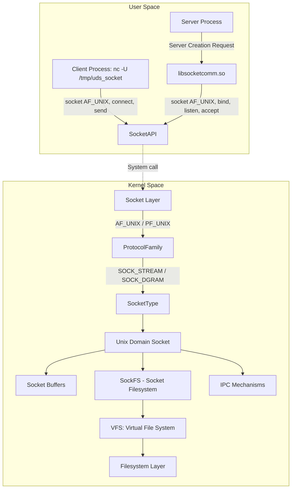

# socket-communication-lib

## Overview

This repository provides a Unix domain socket server implemented in C++14, enabling communication between a server and a client. The server is designed to receive and process data sent from the client, allowing flexible handling of incoming data through a callback mechanism. The server is compiled into a shared library, and an example application is provided to demonstrate its usage.

## Building the Library and Example

The repository provides a shared library and an example application. Follow the steps below to build and run them.

### Building the Library

To build the shared library, run the following commands:

```bash
mkdir build
cd build
cmake .. -G Ninja -DCMAKE_BUILD_TYPE=Release
ninja socketcomm
```


This will generate the libsocketcomm.so shared library.

### Building and Running the Example
To build and run the example application, follow these steps:

```bash
./run.sh
```

This script will:

Remove any existing build directory.
Rebuild the library and the example.
Run the example server application (server_example).
The server will start and wait for client connections on /tmp/uds_socket.

### Running the Client
Once the server is running, you can connect to it using the nc (Netcat) command from the terminal. The server accepts numerical values from the client.

```bash
echo "15" | nc -U /tmp/uds_socket
```

This command sends the value 15 to the server. The server will then store and output the received value.

## Software Stack
Below is a diagram of the software stack used in this project.  



This diagram shows how the client interacts with the Unix domain socket, which is managed by the shared library.

## License
MIT License
